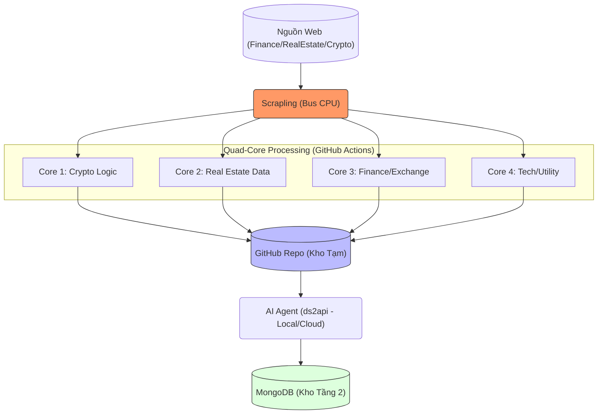

Dưới đây là file README.md được thiết kế theo tư duy kiến trúc hệ thống hiện đại, tối ưu hóa cho mô hình **"0 đồng - 0 thẻ - Tự chủ"**. Bạn có thể sử dụng nội dung này cho mọi repository trong hệ sinh thái của mình.
# T2-CORE: Hệ thống Tự động hóa Dữ liệu "Zero-Cost & Self-Sustaining"
## 1. Triết lý hệ thống
 * **0 Đồng (Zero-Cost):** Loại bỏ hoàn toàn chi phí API, Subscription, và Hosting trả phí. Tận dụng tài nguyên miễn phí từ GitHub Actions, Oracle/Google Cloud Free Tier và sức mạnh tính toán tự thân.
 * **0 Thẻ (Zero-Card):** Không phụ thuộc vào các dịch vụ cần gắn thẻ tín dụng (Stripe/Paypal). Hệ thống sử dụng cơ chế xoay vòng tài khoản (account rotation) tự quản lý, loại bỏ rủi ro bị khóa tài khoản hoặc mất phí ẩn.
 * **Tính tự chủ (Self-Sustaining):** Hệ thống vận hành theo mô hình "Bus CPU" với các luồng xử lý độc lập (Quad-core), nơi dữ liệu tự vận động từ nguồn thô đến kho tri thức mà không cần sự can thiệp thủ công.
## 2. Sơ đồ khối kiến trúc (Architecture Flow)

## 3. Thành phần cốt lõi
### A. Bus CPU - Scrapling
 * **Vai trò:** Đóng vai trò là "Bus dữ liệu" hiệu năng cao, trích xuất dữ liệu thô (raw data) với cơ chế vượt qua bot detection mà không tốn phí proxy trả phí.
 * **Cơ chế:** Hoạt động như một trình xử lý trung gian, đẩy dữ liệu vào luồng Action tương ứng.
### B. Quad-Core (4 GitHub Actions)
Hệ thống được chia thành 4 luồng xử lý độc lập, chạy trên GitHub Actions (miễn phí):
 * **Core 1 (Crypto):** Phân tích biến động giá, whale activity, MFI/RSI tracking.
 * **Core 2 (Real Estate):** Thu thập giá bất động sản, đối soát dữ liệu môi giới.
 * **Core 3 (Exchange):** Giám sát tài khoản sàn, quản trị rủi ro (Margin calls, vị thế).
 * **Core 4 (Utility):** Phát triển công cụ, hỗ trợ AI Agents, xử lý tài liệu nội bộ.
### C. AI Agent & API (ds2api)
 * **Vai trò:** Chuyển đổi cookie tài khoản (DeepSeek/khác) thành chuẩn OpenAI API.
 * **Triết lý:** Sử dụng **Multi-account rotation** để không bao giờ bị rate-limit, đảm bảo "cơn khát token" luôn được giải quyết miễn phí.
### D. Kho lưu trữ (Storage Layer)
 * **GitHub (Kho tạm):** Lưu trữ dữ liệu thô, dùng làm "hệ thống file đệm" để đảm bảo tính an toàn dữ liệu trước khi AI xử lý.
 * **MongoDB (Kho tầng 2):** Lưu trữ kết quả đã phân tích, sẵn sàng cho việc truy vấn và đưa ra quyết định đầu tư/vận hành.
## 4. Nguyên tắc vận hành (Operating Principles)
 1. **Luôn giữ Offline-First:** Các thành phần lõi (emulator, data reader) phải tách rời khỏi nguồn dữ liệu để tránh bản quyền và rủi ro mất mát.
 2. **Tự động hóa hoàn toàn:** Mọi thao tác push/pull dữ liệu, chạy script phân tích, và log vào database đều phải thông qua CI/CD của GitHub.
 3. **Không phụ thuộc (Decoupling):** Nếu một Core bị lỗi, 3 Core còn lại vẫn vận hành bình thường. Nếu dịch vụ web mục tiêu thay đổi cấu trúc, chỉ cần chỉnh sửa Scrapling ở "Bus", không cần thay đổi tầng logic của AI Agent.
 4. **Tối ưu tài nguyên:** Sử dụng SQLite cho các tác vụ cần lưu trữ trạng thái nội bộ nếu cần thiết thay cho các dịch vụ DB đắt đỏ.
## 5. Cấu hình & triển khai
 * **Environment:** Dockerized (mọi dịch vụ chạy trên Docker để đảm bảo tính nhất quán giữa Local và Server).
 * **Auth:** Sử dụng biến môi trường (Environment Variables) để quản lý cookies/tokens. **Tuyệt đối không push file cấu hình lên public repository.**
 * **Monitoring:** Theo dõi logs thông qua chính GitHub Actions Run History.
*Hệ thống được thiết kế bởi Keith Howe (Nguyễn Tiến Hiển) - Tối ưu hóa vì sự bền vững và hiệu suất không giới hạn.*
